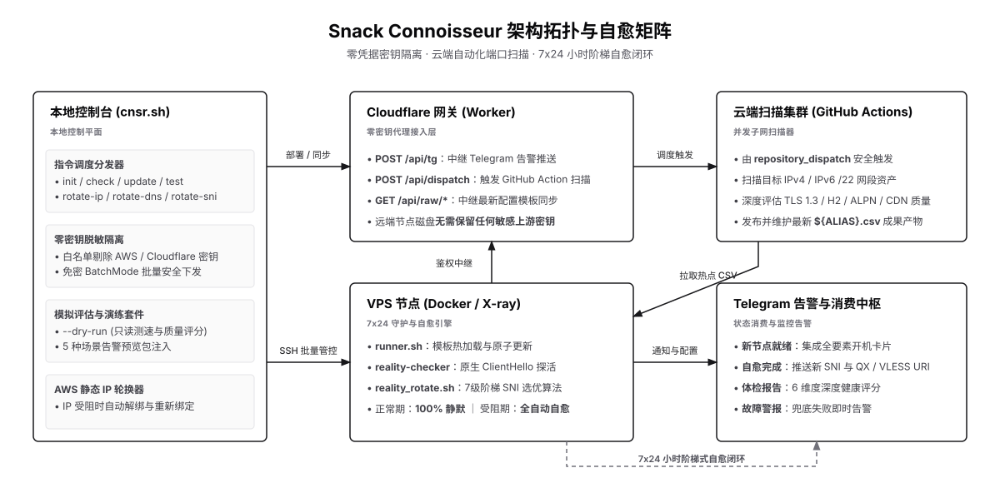

[English](README.md) · [简体中文](README_zh.md)

### Snack Connoisseur

自动化管理云实例的工具，如果想舒适地使用，以下是你需要知道的事。

[架构概览](#架构概览) · [安装使用](#安装使用) · [模版规范](#模版规范) · [项目说明](#项目说明) · [环境变量](#环境变量) · [开源许可](#开源许可)


### 架构概览



[工作流白板 (workflow_zh.canvas)](../assets/workflow_zh.canvas) — 涵盖控制平面、批量开机、自愈轮换、体检审计、远端基础设施与告警体系等整体流程。


### 安装使用

**如何安装**

```bash
# 1. 克隆代码仓库
git clone https://github.com/your-username/snack-connoisseur.git
cd snack-connoisseur

# 2. 赋予入口脚本执行权限
chmod +x cnsr.sh

# 3. 安装运行依赖 (基于 uv 自动初始化 Python 3.12 虚拟环境)
uv sync

# 4. 配置本地环境变量
cp .env.example .env
# 编辑 .env 文件，填入 AWS、Cloudflare、Telegram 等凭据
```


**如何使用**

```text
Snack Connoisseur (cnsr)

使用格式:
  ./cnsr.sh <命令> [别名] [参数] [选项]

核心指令:
  init <别名> [IP]             装配并加固通用 VPS 节点 (选项: --harden, --debug)
  init-aws <别名>              开通并装配 AWS Lightsail 节点 (选项: --region, --count, --bundle, --blueprint)
  init-aws -f <配置文件>       根据预设模板批量开通 AWS 节点
  destroy-aws <别名|匹配模式>  销毁 AWS Lightsail 实例并清理 DNS/SSH 配置 (选项: --region)
  check <别名>                 综合体检审计：网络延迟、SNI 质量、BBR 拥塞控制、容器健康
  update <别名>                全量热更新：无缝同步 runner 垫片、自愈探针及脱敏环境
  rotate-sni <别名>            强制指纹轮换：重置 UUID、密钥对、ShortID 与最优 SNI 域名
  rotate-dns <别名>            主动域名轮换：通过 Cloudflare 刷新二级大厂伪装域名
  rotate-ip <别名>             终极自愈救赎：自动解绑并重新分配 AWS 静态 IP 并级联更新配置
  test-tg <别名>               向 Telegram 下发 5 大场景告警预览示例包
  test-sni <别名>              模拟评估候选 SNI 域名握手质量（不改写任何配置）
  lang [zh|en]                 切换控制台语言 (zh 简体中文 / en 英文)
  help                         显示本帮助手册

选项参数:
  --harden                     启用高强度安全加固 (适用于 init)
  --debug                      输出详细的调试日志 (适用于 init)
  --detach                     后台异步执行批量装配流程（可安全关闭终端）
  --region <区域>              指定 AWS 区域 (例如 ap-northeast-1)
  --count <N>                  指定批量开机台数 (最大支持 20 台)
  --key-pair <密钥名>          指定绑定的 AWS Key Pair 名称
  -f, --file <配置名>          指定 batch 批量配置模板名称 (读取 templates/<name>.conf)
  -h, --help, -help            显示帮助信息

快速示例:
  ./cnsr.sh init sg_aws 198.51.100.1 --harden                        # 初始化单台通用 VPS 并加固
  ./cnsr.sh init-aws aws-node --region ap-northeast-1 --count 3     # 批量开通 3 台东京节点
  ./cnsr.sh init-aws -f jp_aws-lightsail --count 3                   # 使用模板批量开通 3 台节点
  ./cnsr.sh init-aws -f jp_aws-lightsail --count 3 --detach          # 脱机异步部署（安全关闭窗口）
  ./cnsr.sh destroy-aws "jp_aws-lightsail-*" --region ap-northeast-1 # 批量销毁匹配节点
  ./cnsr.sh check sg_aws                                             # 执行全维度节点体检
  ./cnsr.sh test-tg sg_aws                                           # 发送 Telegram 告警卡片预览
  ./cnsr.sh test-sni sg_aws                                          # 模拟测速评估 SNI 域名质量
  ./cnsr.sh lang zh                                                  # 切换为简体中文界面
```


**场景案例**

* **场景 1：一键批量开通 5 台东京高可用节点** — 使用预设模板并在后台脱机执行，部署进度实时推送到 Telegram。
```bash
./cnsr.sh init-aws -f jp_aws-lightsail --count 5 --detach
```

* **场景 2：日常巡检与多维健康评分** — 审计节点网络延迟、TLS 质量、内核 BBR 拥塞控制及 Docker 状态。
```bash
./cnsr.sh check jp_aws-lightsail-1
```

* **场景 3：节点遭遇 GFW 阻断时一键换 IP 自愈** — 自动释放旧 IP、申请新静态 IP 并级联更新 Cloudflare 与 SSH 配置。
```bash
./cnsr.sh rotate-ip jp_aws-lightsail-1
```

* **场景 4：定期重置流量特征与伪装域名** — 彻底刷新 UUID、x25519 密钥对与 SNI 伪装域名，规避流量建模识别。
```bash
./cnsr.sh rotate-sni jp_aws-lightsail-1
./cnsr.sh rotate-dns jp_aws-lightsail-1
```

* **场景 5：批量回收销毁测试集群** — 通配符一键清理云端实例、静态 IP、Cloudflare 解析记录与本地 SSH 别名。
```bash
./cnsr.sh destroy-aws "jp_aws-lightsail-*" --region ap-northeast-1
```


### 模版规范

`templates/` 目录按功能用途归纳为 4 大核心类别：

| 模板类别 | 包含文件 | 核心作用与规范说明 |
| :--- | :--- | :--- |
| **开机预设模板** | `jp_aws-lightsail.conf`<br>`sg_aws-lightsail.conf`<br>`us_aws-lightsail.conf` | 定义 AWS Lightsail 各地域实例规格、系统镜像、双栈网络（`dual`）与防火墙放行端口 |
| **服务配置模板** | `compose.yml.template`<br>`config.json.template` | Docker 容器编排与核心协议配置（端口映射、证书指纹、动态 SNI 回落与分流策略） |
| **自愈探针模板** | `runner.template.sh`<br>`reality_rotate.template.sh`<br>`reality_check.template.sh`<br>`async_deploy.template.sh` | 远端 15 分钟 Cron 守护进程、7 级阶梯 SNI 选优算法、双栈 TLS 真实握手探针及后台异步脱机部署脚本 |
| **告警通知模板** | `tg_templates.sh`<br>`tg_templates.md` | Telegram Bot 5 大场景结构化告警卡片渲染器（开机就绪、换 IP 成功、健康巡检、自愈恢复、故障警报） |

```bash
# 示例：templates/jp_aws-lightsail.conf
ALIAS_BASE="jp_aws-lightsail"      # 生成节点的前缀别名
REGION="ap-northeast-1"            # AWS 数据中心区域
BUNDLE_ID="nano_3_0"               # 机器规格 ($3.50/月)
BLUEPRINT_ID="debian_12"           # 操作系统镜像
KEY_PAIR_NAME=""                   # 可选指定的 AWS 密钥对
HOST_FIREWALL="ufw"                # 主机防火墙类型 (ufw)
IP_STACK="dual"                    # 网络协议栈 (dual 双栈 / ipv4 / ipv6)
PORTS_TCP="22,443"                 # 允许放行的 TCP 端口
PORTS_UDP="443"                    # 允许放行的 UDP 端口
COUNT=1                            # 默认批量创建数量
```

其他模版请自行研究 (`templates/*`)。


### 项目说明

```text
snack-connoisseur/
├── assets/                     # 架构拓扑图等静态媒体资产
├── core/                       # 节点初始化、体检、更新与轮换自愈核心模块
├── gateway/                    # 零密钥安全边缘网关 (Cloudflare Worker)
├── lib/                        # 安全脱敏、SSH 互信与 UI 终端渲染通用库
├── providers/                  # 云厂商 (AWS Lightsail) API 驱动适配层
├── templates/                  # 节点批量配置预设与告警消息模板
├── tests/                      # pytest 自动化单元测试套件
├── tools/                      # 本地探针与辅助执行工具
├── cnsr.sh                     # CLI 入口总控脚本
├── LICENSE                     # MIT 开源许可证
└── pyproject.toml              # Python 3.12 依赖与工程配置
```


### 环境变量

| 环境变量名称 | 作用说明 | 涉及的指令模块 |
| :--- | :--- | :--- |
| `AWS_ACCESS_KEY_ID` | AWS IAM 访问密钥 ID | `init-aws`, `destroy-aws`, `rotate-ip` |
| `AWS_SECRET_ACCESS_KEY` | AWS IAM 访问私钥 | `init-aws`, `destroy-aws`, `rotate-ip` |
| `CF_API_TOKEN` | Cloudflare DNS 编辑权限 Token | `init`, `init-aws`, `rotate-dns`, `rotate-ip` |
| `CF_ZONE_ID` | Cloudflare 托管域名的 Zone ID | `init`, `init-aws`, `rotate-dns`, `rotate-ip` |
| `TG_BOT_TOKEN` | Telegram Bot 告警推送 Token | `check`, `test-tg`, 远端自愈告警 |
| `TG_CHAT_ID` | Telegram 接收告警的目标 Chat ID | `check`, `test-tg`, 远端自愈告警 |
| `GH_TOKEN` | GitHub Personal Access Token | 本地直接调度 IP 扫描时备用 |
| `GATEWAY_URL` | Cloudflare Worker 零密钥网关地址 | 安全下发云端 IP 扫描 |
| `GATEWAY_AUTH_KEY` | 零密钥网关 Bearer 鉴权密钥 | 安全下发云端 IP 扫描 |
| `CNSR_LANG` | 控制台默认输出语言 (`zh` 或 `en`) | 所有交互与命令行输出 |


### 开源许可

MIT License — 做你想做的事，但要尊重边界。
