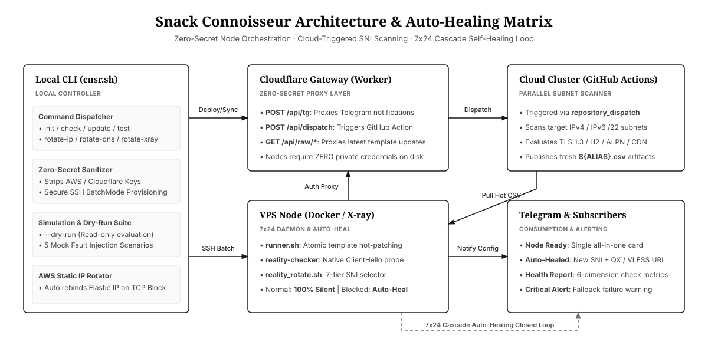

# Snack Connoisseur

## Architecture



---

## Usage

```text
Snack Connoisseur (cnsr) - X-ray REALITY Controller & Anti-Censorship Suite

USAGE:
  ./cnsr.sh <command> [subcommand] [alias] [arguments] [options]

COMMANDS:
  init <alias> [ip]            Provision a new VPS node (Options: --harden, --debug)
  check <alias>                Comprehensive health check: latency, SNI quality, BBR, container
  update <alias>               Full hot-update: sync runner shim, self-healing probe, sanitized env
  rotate sni <alias>           Force fingerprint rotation: reset UUID, keys, ShortID, and SNI (Option: --dry-run)
  rotate dns <alias>           Active domain rotation: refresh secondary domain via Cloudflare
  rotate ip <alias>            Ultimate survival: auto rebind new AWS Lightsail IP & cascade update
  test <alias> [tg]            Push preview sample pack (5 alerts) to Telegram
  lang [zh|en]                 Switch system language (Simplified Chinese zh / English en)
  help                         Show this help manual

OPTIONS:
  -harden, --harden            Enable high-security hardening (for init)
  -debug, --debug              Enable verbose debugging output (for init)
  -dry-run, --dry-run          Simulate SNI evaluation without modifying configuration (for rotate sni)
  -h, --help, -help            Show this help manual

EXAMPLES:
  ./cnsr.sh init sg_aws 198.51.100.1 --harden      # Compound action initialization
  ./cnsr.sh test sg_aws tg                         # Preview Telegram alert samples
  ./cnsr.sh check sg_aws                           # Full node health check
  ./cnsr.sh rotate sni sg_aws --dry-run            # Dry-run SNI rotation
  ./cnsr.sh lang en                                # Switch language to English
```
